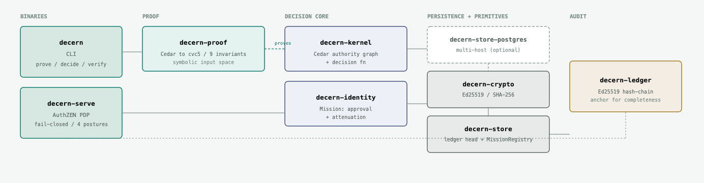

<!-- SPDX-License-Identifier: Apache-2.0 -->

  <picture>
    <source media="(prefers-color-scheme: dark)" srcset="docs/img/decern-mark-dark.svg">
    
  </picture>

# Architecture

A map of decern for contributors — human or agent. If you're here to pick something up, the
per-crate table below tells you *where* things live, and [CONTRIBUTING.md](CONTRIBUTING.md) tells
you *how* to land a change.

## The shape

A decision is a **pure function of `(principal, authority graph, policy, now)`**. Everything else
is arranged around that function: a proof harness that machine-checks its safety properties, a
tamper-evident ledger that records what it decided, and thin binaries that expose it.

Two binaries over seven library crates. The stock build is pure Rust; the one exception —
`decern-store-postgres` — carries a TLS stack behind a build flag and is off by default.

| Crate | Kind | Responsibility |
|---|---|---|
| `decern-kernel` | lib | The deterministic decision function. Cedar authority graph, the `Directory`, `Kernel::check`. This is the security core. |
| `decern-proof` | lib | The SMT proof harness. Compiles the Cedar model symbolically and discharges the nine invariants with cvc5, with per-invariant negative controls. |
| `decern-ledger` | lib | The tamper-evident record. Append-only, Ed25519-signed, hash-chained over each entry's exact stored bytes; RFC 9162 Merkle tree heads and proofs, anchors, single-file + sharded. JCS canonicalization is used for the digests an entry binds, not for the chain. |
| `decern-store` | lib | Persistence traits + reference impls. `LedgerHeadStore` (single-host `flock` head store) and the durable `MissionRegistry`. |
| `decern-store-postgres` | lib *(optional)* | Multi-host `LedgerHeadStore` over Postgres advisory locks. Adds the TLS stack (rustls/ring) to the compiled-native dependencies; behind `--features postgres`. |
| `decern-identity` | lib | The Mission core: approval-backed, provably-attenuated authority (`approve`, `ApprovedMission`, `MissionRegistry`). |
| `decern-crypto` | lib | Ed25519 + SHA-256 primitives shared by the ledger and identity. |
| `decern-cli` | bin → `decern` | `prove` / `decide` / `verify`. |
| `decern-server` | bin → `decern-serve` | The fail-closed AuthZEN PDP: evaluate, record, serve. Also serves the Mission lifecycle over `decern-identity` (`POST /mission/v1/approve`, `GET`/`terminate`), recording each transition to the ledger. |

`decern-server` is split by layer, one seam per file: `main.rs` (flags, the caller-posture
refusal, startup), `routes.rs` (the router and the guarded/open split), `caller.rs` (how the
caller is established: the posture enum, the `CallerAuth` trait every posture implements, and
the one guard layer over the protected routes), `bearer.rs` (RFC 9068 token validation),
`sig.rs` (RFC 9421 message signatures bound to an RFC 7800 `cnf` claim), `spiffe.rs`
(SPIFFE JWT-SVID validation against pinned trust bundles), `record.rs` (the
fail-closed append path), `decide.rs` (the decision handler and its derivations), `audit.rs`
(the published reads: pubkey, tree head, subject projection, descendants, disclosure),
`mission.rs` (the lifecycle), `challenge.rs` (the subject-side challenge), `testutil.rs`
(shared fixtures).

The three credential postures sit under `caller.rs` and know nothing of each other: each
owns one spec's rules and implements the same trait, so the guard dispatches once and a
posture added later cannot skip a step by being wired in differently.

`crates/decern-kernel/model/` holds the Cedar policy, schema, and entities the kernel loads. `examples/` holds the worked integrations and the quickstart — runnable and CI-tested, never published as crates. `.agent/` holds the working
method and the standards registry. `scripts/verify.sh` is the one gate every change must pass.

## How a decision flows

1. A request reaches `decern-serve` (`POST /access/v1/evaluation`, AuthZEN-shaped), and the
   caller is established first, by one of four named postures: an RFC 9068 bearer token, an
   RFC 9421 signed request, a SPIFFE JWT-SVID, or the declared front under `--trust-proxy`.
   All three credential postures verify against keys configured at startup — nothing is
   fetched. A server with no posture named refuses to start, and naming two is a startup
   failure; under any credential posture a request with no verified caller is refused before
   anything is evaluated or recorded. The two *workload* postures (signed request, SPIFFE)
   additionally bind the caller to the principals it may name, unless it is listed in
   `--pep`.
2. `decern-kernel` evaluates the pure decision function over the loaded authority graph and policy.
   The server supplies `now` from its own clock (never the request body).
3. The decision, plus a server-derived **accountable-owner** (the root of the subject's
   delegation chain) and — under any credential posture — the **asserting caller** exactly as
   verified, is appended to the `decern-ledger` — Ed25519-signed and hash-chained, the exact
   request digest-bound (`digests.parameters`).
4. The decision is returned **only if that record was written**. If it couldn't be, the server
   returns `503`, never a bare allow. This fail-closed contract is the whole point of the PDP.
5. Anyone can run `decern verify` over the ledger afterwards. The signatures prove each
   record is authentic, and the chain proves the log hangs together. Neither proves nothing
   was dropped — whoever wrote the log can rewrite it and re-chain it, and it will still
   pass. Catching a dropped tail takes `--anchor`, checked against a tree head published
   somewhere the operator cannot reach. That is the step that stops requiring trust in them,
   and it does not work for `--sharded` yet. See [`decern verify`](docs/CLI.md#decern-verify).

The same binary also reaches `decern-identity` for the **Mission lifecycle**: `POST /mission/v1/approve`
grants an agent a scoped, fail-closed-attenuated authorization context (refused, and nothing recorded,
if it exceeds the approver's own authority or expiry); `GET /mission/v1/{s256}` reports its state; and
`POST /mission/v1/{s256}/terminate` ends it, with no revival. Each accepted transition is appended to
the ledger under the same fail-closed contract as a decision — a 503 rather than an unrecorded success —
so a Mission's whole history is as externally verifiable as the decisions it authorizes. The durable
Mission registry (`decern-store`) holds the authoritative state, so a termination outlives any single
process.

## How the guarantees are established

The safety properties are not tested on examples — they're **proven over the modeled input domain**.
`decern-proof` compiles the Cedar model with a symbolic compiler and asks cvc5 whether each of the
nine invariants can be violated; a green suite means it could find no counterexample anywhere in the
domain. Each invariant ships with a **negative control** — a test that removes the guarantee from the
policy and asserts cvc5 then *finds* a counterexample — so a passing suite is evidence the proofs are
load-bearing. Proof statements are calibrated to exactly what the solver certifies; where a property
depends on a derived attribute (e.g. the transitive delegation closure), the derivation is trusted
Rust covered by property tests and is documented as such. See `decern-proof` and `AGENTS.md`.

The solver runs in `decern prove` and CI only — `decern-serve` does not link it. The guarantee is
established where the proofs run, not on the request path.

## Where to start contributing

Match a contribution area to the crate that owns it:

- **A new client SDK** → mirror `sdks/go` / `sdks/python` / `sdks/typescript` against the AuthZEN surface in `decern-server`.
- **Enforcement adapters** → the HTTP forward-auth shim shipped (`examples/ext_authz_adapter/`,
  contributed); extend it, or bring the gRPC `ext_authz` variant.
- **Agent-protocol integrations** → `examples/mcp/` is the worked MCP integration; other agent
  protocols compose the same way — validate the caller, consult the PDP per action, record.
- **Authority-graph tooling** (traversal, blast-radius, export) → `decern-kernel`'s `Directory`.
- **A new ledger backend** → implement `decern-store`'s `LedgerHeadStore` trait.
- **A new proven property** → `decern-proof` (add the invariant *and* its negative control).
- **Model / policy packs** → `crates/decern-kernel/model/`.

Read [`AGENTS.md`](AGENTS.md) (the method), [`.agent/standards/`](.agent/standards/) (the conventions,
including the comment standard), and [CONTRIBUTING.md](CONTRIBUTING.md) before opening a change.
