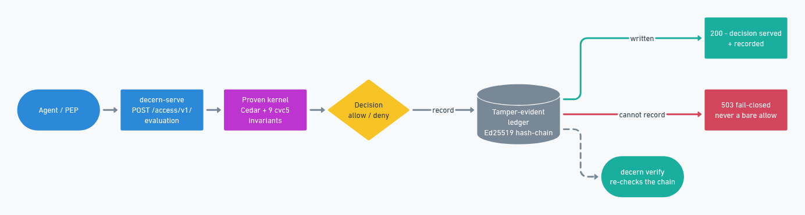

<!-- SPDX-License-Identifier: Apache-2.0 -->
<p align="center">
  <picture>
    <source media="(prefers-color-scheme: dark)" srcset="docs/img/decern-mark-dark.svg">
    
  </picture>
</p>

# decern

A deterministic authorization kernel whose safety properties are **machine-checked over
every possible input**, not just tested on examples — with a hash-chained, tamper-evident
decision ledger anyone can verify without trusting the operator.

<p align="center">
  <a href="https://github.com/anivar/decern/actions/workflows/ci.yml"></a>
  <a href="https://crates.io/crates/decern-cli"></a>
  <a href="https://docs.rs/decern-ledger"></a>
  <a href="https://pypi.org/project/decern/"></a>
  <a href="https://www.npmjs.com/package/decern"></a>
  <a href="LICENSE"></a>
  <a href="https://doi.org/10.5281/zenodo.21848620"></a>
  <a href="https://github.com/anivar/decern/graphs/traffic"></a>
  <a href="https://github.com/anivar/decern/graphs/traffic"></a>
</p>

[Website](https://decern.anivar.net/) · [Commands](docs/CLI.md) · [Roadmap](ROADMAP.md) ·
[Releases](https://github.com/anivar/decern/releases) · [Security](SECURITY.md)

The industry standardizes how authority is *represented* — tokens, delegation envelopes,
decision-request formats — and defers the *guarantee* (that attenuation holds, that nothing
was dropped from the log, that a decision stayed within its mandate) to implementer policy.
decern is the guarantee.

## Architecture

Two binaries over seven small crates: a proven decision core, an SMT proof harness, a
tamper-evident ledger, and pure-Rust persistence and primitives.

<p align="center"></p>

## What is proven

A decision is a pure function of `(principal, authority graph, policy, now)`. **9 invariants**
over that function are discharged by an SMT solver (cvc5) across the entire input space — not
sampled. Each statement is calibrated to exactly what the solver checks, so a proof never
claims more than the machine verified:

- **money-gate** — no privileged money action without explicit approval
- **isolation** — no decision ever crosses a tenant boundary
- **decay** — no decision once authority has expired
- **attenuation-edge** — no access without ownership, a delegation ancestor, or an explicit grant
- **scope-gate** — bounded actions require their scope
- **revocation-gate** — a revoked principal is allowed nothing
- **residency-gate** / **role-gate** / **consent-gate** — data-bound access conditions

## What is recorded

Every decision lands in an append-only, Ed25519-signed, hash-chained ledger. A crash-torn tail
heals; an attacker truncating committed history is detected. The audit trail is externally
verifiable — a signature proves a record is authentic, the chain proves nothing was dropped.

A decision is served **only if its audit record was written** — an unrecordable decision returns
503, never a bare allow:

<p align="center"></p>

Each decision recorded by the PDP also carries a derived **accountable-owner**: the root of the
subject's delegation chain, resolved server-side from the directory (never a request input). A
delegate's record names the principal ultimately answerable for it; a root principal sponsors
itself; a caller the directory doesn't recognize has none. It is a recorded accountability column,
not a decision gate — it never changes the allow/deny outcome.

A record can also name the **decision subject** — the party a decision is taken *upon*, which is a
different question from who asked for it and from who answers for it. An agent screening an
applicant, or posting about someone on another person's timeline, acts on a party that the subject,
the resource and the accountable owner all fail to name; without a column for it, the party the
record most concerns is the one the record leaves out.

It is carried in the request context as a **pseudonymous handle**, optionally with the scheme it
belongs to and the purpose it was minted for — a reference that addresses a party without naming
one, so an audit trail does not become a place personal data accumulates. Resolving it back to a
person is a separate authority's job, and deliberately not decern's.

Three rules keep it honest. It never reaches the decision: it is taken out of the context before
the kernel runs, so who a decision is about cannot change what the decision is. It is recorded only
when it says something the record does not already say — a decision about the requester, or about
the owner of the resource named, carries none. And a handle that identifies a person rather than
standing in for one is refused, because the record is appended, signed and chained, and that
request is the last moment such a value can be kept out of it.

This implements [`draft-aravind-oauth-decision-subject-00`](https://datatracker.ietf.org/doc/draft-aravind-oauth-decision-subject/).
The draft notes that an unsigned decision subject cannot be trusted to identify a party; here every
record carrying one is Ed25519-signed and hash-chained, so the claim is exactly as trustworthy as
the record it sits in.

A recorded decision looks like this. Here an unrecognized caller — `agent-7`, not in the directory —
is refused a `MoveMoney`, so the record carries `decision: false` and **no `sponsor`** (an
accountable-owner is derived only for a caller the directory knows), and its `prev` is the previous
record's `hash` — the chain link:

```json
{"entry":{"seq":1,"ts_ms":1785682110000,
          "subject_type":"Principal","subject_id":"agent-7",
          "action":"MoveMoney","resource_type":"Resource","resource_id":"account9",
          "context":{"now":1785682110},"decision":false},
 "prev":   "8f658ccb5595b7e85a9f020f6a128985929865558c642505e206134337e40e41",
 "hash":   "590547867e1d4592d68d028f0d61745146ab986499dfadd073eacafcf58e63b8",
 "sig_b64":"vtUu4gP1CkgqKIYDpHuYHtbez/XROdcnpOq8Y3aZdbfeVHK2tT3mpp9yvmTlTF2QtYtZxg7TbP/f6SqfZ/eWDQ==",
 "kid":    "d9396c76113e7aa7126b8358063331f9749ece673ddfdbe8b29661bf03714372"}
```

### Anchoring

A hash chain proves a log holds together, which the party that wrote it can always arrange. It
does not prove nothing was quietly removed. For that the operator publishes a signed commitment
somewhere they do not control — `GET /anchor/v1/tree-head` returns one, a Merkle root and a size
that disclose nothing about what was decided — and anyone can later check the log still extends it:

```sh
decern verify --ledger /tmp/decern.jsonl --pubkey <kid> --anchor anchor.json
```

A log truncated below its anchored size fails that check while still passing an ordinary verify,
which is the whole point: dropping a committed record stops being a rule someone broke and starts
being arithmetic that does not work.

The other direction is `GET /audit/v1/subject?handle=<handle>`: what was decided *about* one party,
each record with a proof that it sits in the tree the response's own head commits to. That head is
the operator's, so the proofs are only worth what it is worth — check it against an anchor obtained
separately before believing any of them. Proofs and an unanchored head from the same source prove
internal consistency, which an operator can always arrange. A party who suspects a decision
was made about them can ask, and check the answer against a commitment published earlier — the
response carries proofs and never keys, because a key handed over in the same response would prove
only that an operator can sign their own account of events. The handle matches exactly and nothing
enumerates, so it answers someone who already knows their own handle and tells everyone else
nothing.

`reasons:["policy9"]` is the deny-by-default catch-all; the missing `sponsor` is the "unknown caller
has none" case above. `decern verify --ledger <file> --pubkey <kid>` re-checks the chain (always) and
every signature (with the key).

### Challenging a decision

Recording who a decision affected gives that party a name on the record. The other half is
that they can say it was wrong and be answered. A challenge arrives in the decision context
with a signed token proving standing, the grounds, and what the party is asking for.

It never touches the decision. The challenge is taken out of the context before the kernel
runs, so a request carrying one is evaluated exactly as the same request without one — which
is why a forged challenge cannot escalate anything. A challenge that cannot be believed is
refused, like any malformed request, so the decision it named is left exactly as it was — but a
caller who sends one gets an error instead of an answer, which is worth saying rather than
claiming a challenge can never affect a response at all.
Answering happens afterwards, and the answer and its reason go on the record beside the
decision they concern. Evidence is recorded as a digest rather than copied in: what a party
sends to argue their case is likely to be about them, and this log cannot be edited.

Standing tokens are verified against issuer keys the operator configures
(`--standing-issuer-key`), not fetched at request time. A decision must not depend on a third
party being reachable, and this binary carries no outbound TLS stack. A deployment that
configures no issuers accepts no challenges, and says so.

What a given deployment actually supports is at
`GET /.well-known/decern-subject-side-disclosure`, read from its running configuration so it
cannot drift from the binary — including the answer it declines to offer, since handing a
challenge to a human approver needs an approver service this server does not have.

## Missions

`decern-serve` also serves a **Mission lifecycle** over `decern-identity`: an approver grants an
agent a scoped, fail-closed-attenuated authorization context — "these tools, until this time." A
Mission whose `approved_tools` exceed what the approver holds, or whose expiry outlives the
approver's, is refused and nothing is recorded. Every accepted transition is written to the same
tamper-evident ledger before it is reported as succeeded (a 503 otherwise); a terminated Mission
never revives. A Mission's reference `s256` is a pure function of its approval parameters
(approver, agent, description, approved_tools, capabilities, expiry), so re-approving an *identical*
terminated grant is refused as a 409 — a fresh grant must differ in at least one approved field.

```
POST /mission/v1/approve            {approver, agent, description, approved_tools, capabilities?, expiry}
                                    -> {approver, s256, reference}
GET  /mission/v1/{s256}             -> {reference, state: active|terminated, expiry}
POST /mission/v1/{s256}/terminate   -> {reference, state: terminated}
```

The registry is durable and local (`--missions <PATH>`, default `decern-missions.json` alongside
the ledger) — sovereign, consulted in-perimeter, no phone-home.

## Principals

Humans, agents, and workloads are one principal type, decided by the same proven function.

## Quickstart

### Install

Two binaries: `decern` to prove and verify, `decern-serve` to answer requests.

```sh
cargo install decern-cli decern-server
```

Or grab a prebuilt, signed binary for Linux (x64/arm64), macOS (Apple Silicon) or Windows (x64) from
the [releases page](https://github.com/anivar/decern/releases). The proofs (`decern prove`) also need
the **cvc5** solver on `PATH`; serving answers does not.

### Prove → serve → decide → verify

```sh
# 1. Prove all invariants hold over every input (cvc5)
decern prove

# 2. Run the PDP (writes a tamper-evident ledger)
decern-serve --ledger /tmp/decern.jsonl &

# 3. Decide over HTTP (AuthZEN-shaped) — corp reads a claim it owns
curl -s localhost:8080/access/v1/evaluation -H 'content-type: application/json' -d '{
  "subject":  {"type":"Principal","id":"corp"},
  "action":   {"name":"Read"},
  "resource": {"type":"Resource","id":"claim1"}
}'

# 4. Verify the ledger (hash chain + every signature)
decern verify --ledger /tmp/decern.jsonl \
  --pubkey "$(curl -s localhost:8080/pubkey | jq -r .kid)"
```

From a source checkout, use `cargo run -p decern-cli --` and `cargo run -p decern-server --` in place
of `decern` and `decern-serve`.

### Client SDKs

To call a running `decern-serve` from an application, thin AuthZEN 1.0 PDP clients are published:

```sh
uv add decern                              # Python
npm install decern                         # TypeScript / JavaScript
go get github.com/anivar/decern/sdks/go    # Go
```

### Hosted

Hosted (multi-process, single host): `decern-serve --sharded <dir>` runs the multi-process sharded
ledger instead of the single file — several `decern-serve` processes on one host share one
tamper-evident ledger, one hash chain per tenant, coordinated by the `flock` file head store.
Audit that deployment with `decern verify --sharded <dir> --pubkey <kid>`, which checks every
shard's hash chain and signatures and exits non-zero if any shard fails.

Hosted (multi-host): `--sharded` also accepts a `postgres://` URL, backed by the
`decern-store-postgres` advisory-lock head store, so replicas on *different* hosts share one ledger.
That backend needs a TLS stack, so it is behind a build flag — `cargo build -p decern-server
--features postgres` — and the default binary carries no TLS stack. The postgres URL is never logged.

`--sharded` and `--ledger` are mutually exclusive.

[`examples/quickstart.sh`](examples/quickstart.sh) runs the whole loop — prove → serve → decide →
verify → tamper-is-rejected — end to end. Contributors run [`./scripts/verify.sh`](scripts/verify.sh)
(every gate) before a PR; see [CONTRIBUTING.md](CONTRIBUTING.md).

## Known limitations

- **Trust boundary — the HTTP endpoints are unauthenticated by design.** Both the
  decision PDP (`/access/v1/evaluation`, `/decide`) and the mission-mutation endpoints
  (`/mission/v1/approve`, `/mission/v1/{s256}/terminate`) trust their caller: the mission
  endpoints take `approver` as a request-body field and do **not** authenticate it. Deploy
  `decern-serve` behind an authenticating proxy (or on a trusted network) that derives and
  validates the caller's identity — in particular the mission `approver` — and keep the
  bind loopback (`--addr`, default `127.0.0.1:8080`) unless such a proxy fronts it. Binding
  a non-loopback `--addr` logs a startup `WARN` for this reason.

- **Sharded ledger head store — `FileLedgerHeadStore` is single-host.** The
  persistent reference backend for the sharded ledger (`decern-store`) uses an
  exclusive advisory file lock (`flock LOCK_EX`) per shard to serialize each
  read-then-append critical section. That gives correct **multi-process**
  exclusion on **one host** (Unix only), and is the sovereign single-node
  default. It is **not** a multi-*host* distributed store — `flock` is
  host-local. For multi-*host* deployments, `decern-store-postgres` implements
  the same `LedgerHeadStore` trait over Postgres transaction advisory locks
  (`--sharded postgres://…`, build with `--features postgres`); it adds a TLS
  provider (compiled C) and so is optional and off by default.

- **The default build is not free of compiled native code.** It pulls no TLS
  stack, no OpenSSL and no cmake, but `cedar-policy` → `stacker` → `psm` compiles a
  small assembly stack-switching routine through `cc`, so building the default
  binaries needs a C/assembler toolchain. The honest claim is "no TLS/OpenSSL/cmake
  in the default build," not "zero compiled native code."

## Contributing

Contributions are welcome — from people and from agents. Good places to start are in
[ARCHITECTURE.md](ARCHITECTURE.md#where-to-start-contributing) (each area mapped to the crate that
owns it) and the [`help wanted`](https://github.com/anivar/decern/labels/help%20wanted) issues.

- **Open an issue to discuss first** for anything large or design-changing — a short back-and-forth
  saves a wasted PR. For a small, obvious fix, **just raise a PR**; the linked discussion isn't
  required for those.
- Every change must pass [`./scripts/verify.sh`](scripts/verify.sh) (build · test · cvc5 proofs ·
  clippy · fmt · cargo-deny · standards guard) and be [DCO](https://developercertificate.org/)
  signed off (`git commit -s`).
- **Agent contributors:** [`AGENTS.md`](AGENTS.md) is your entry point, and
  [`.agent/`](.agent/) holds the method and standards. Agent-authored PRs are welcome under the
  same rules — a human still sign-offs the DCO.

See [CONTRIBUTING.md](CONTRIBUTING.md) for the full loop and [GOVERNANCE.md](GOVERNANCE.md) for how
changes are reviewed and merged. Project-health evidence is kept explicit:
[ADOPTERS.md](ADOPTERS.md) names deployments only with permission,
[RELEASES.md](RELEASES.md) documents the release mechanics, and
[DEPENDENCIES.md](DEPENDENCIES.md) documents dependency and license controls.

## Citing

Each release is archived and given a DOI. Cite the concept DOI —
[10.5281/zenodo.21848620](https://doi.org/10.5281/zenodo.21848620) — which always resolves to the
newest version, or a version DOI when a specific release matters for reproducibility.
[CITATION.cff](CITATION.cff) carries the metadata, and GitHub's "Cite this repository" renders it.

## License

Apache-2.0. See [LICENSE](LICENSE) and [NOTICE](NOTICE).
